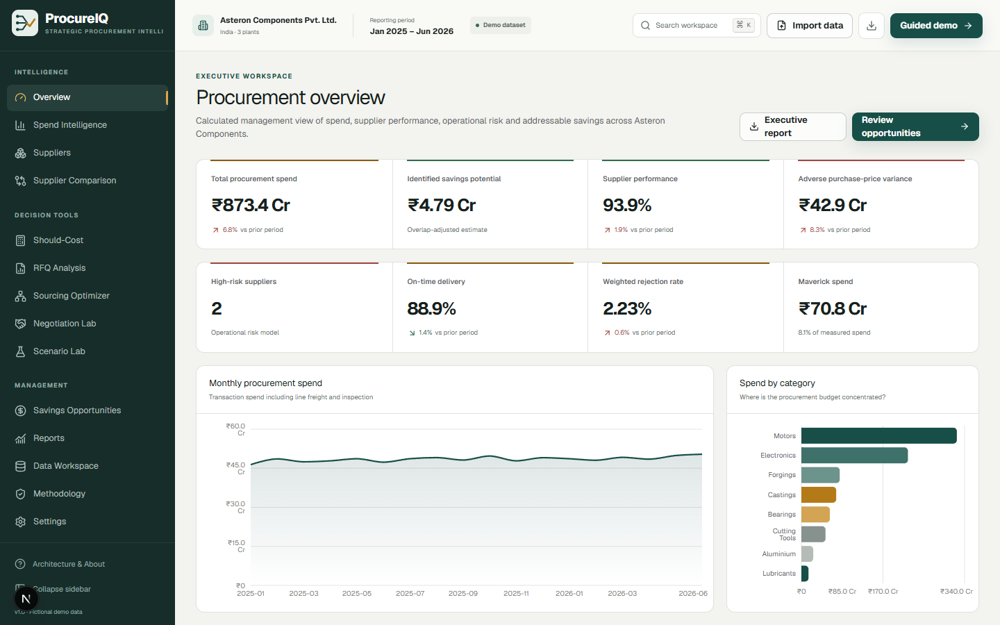

<p align="center"></p>

# ProcureIQ

**Turn procurement data into better sourcing decisions.**

ProcureIQ is a full-stack strategic procurement, cost-intelligence and sourcing decision platform built around a deterministic fictional manufacturing dataset. It connects spend visibility to supplier evaluation, should-cost modelling, RFQ normalization, constrained sourcing allocation, negotiation economics and disruption scenarios.

**Live application:** [procureiq-olive.vercel.app](https://procureiq-olive.vercel.app)

**Repository:** [github.com/VorteXEkansh/ProcureIQ](https://github.com/VorteXEkansh/ProcureIQ)



## Business problem

Procurement teams frequently have transaction records but no connected way to answer the management question: “What should we do next?” A low quotation can become expensive after freight, defects, inventory, delay, capacity and concentration are considered. ProcureIQ makes those trade-offs measurable and explainable.

## Core features

- Executive overview with calculated KPIs, risk-versus-spend and a management-attention queue.
- Spend intelligence with working period/category/plant filters, ABC, Pareto, concentration, HHI, PPV and maverick spend.
- Supplier directory, operational-risk model, editable weighted scorecard, performance profiles and comparison.
- Total-cost model including freight, inspection, expected quality, pipeline inventory, delay and administration.
- Operation-level should-cost model with raw-material yield, scrap recovery, conversion, setup, tooling, overhead, logistics, margin and sensitivity range.
- RFQ evaluation separating lowest quotation, lowest evaluated cost and recommended offer.
- Local sourcing optimizer enforcing demand, capacity, MOQ, supplier concentration, quality, risk and exclusions.
- Negotiation break-even and scenario simulations for demand, commodity, freight, quality, lead-time and capacity shocks.
- Savings opportunity pipeline with overlap-aware totals, confidence, difficulty, priority and locally persisted status.
- CSV/XLSX import, local validation and mapping, JSON backup/restore, print-ready reports and guided recruiter demo.

## Example decision workflow

1. Open **Overview** and frame the highest-value management issue.
2. Filter **Spend Intelligence** to Aluminium and inspect adverse PPV and Pareto concentration.
3. Open **Arka Precision Metals** in Suppliers and review delivery, defect and operational-risk evidence.
4. Use **Supplier Comparison** to show why the lowest quote is not necessarily the lowest TCO.
5. Open **Aluminium Bracket** in Should-Cost and quantify operation-level negotiation headroom.
6. Evaluate the related RFQ, then enforce a 60% maximum share in **Sourcing Optimizer**.
7. Apply **Supplier Capacity Loss** in Scenario Lab and explain the sourcing-policy change.

See [docs/DEMO_GUIDE.md](docs/DEMO_GUIDE.md) for the 3–5 minute interview version.

## Analytics and optimization

All intelligence is deterministic—there is no LLM or remote optimizer. The domain layer contains typed functions for spend, ABC/Pareto, PPV, scoring, operational risk, TCO, should-cost, RFQ evaluation, savings, negotiation, scenarios and sourcing allocation. Formulas, assumptions and limitations are documented in the product and [methodology guide](docs/METHODOLOGY.md).

The sourcing optimizer minimizes expected total cost while satisfying:

```text
Σ allocationᵢ = demand
allocationᵢ ≤ supplier capacityᵢ
allocationᵢ / demand ≤ maximum supplier share
qualityᵢ ≥ minimum quality score
riskᵢ ≤ maximum risk score
allocationᵢ = 0 for excluded suppliers
positive allocation respects MOQ and minimum allocation
```

## Architecture

```text
Browser UI
   ↓
Next.js App Router
   ↓
Validated Route Handlers
   ↓
Typed Procurement Domain Engine
   ↓
Analytics + Optimization + Simulation

Local persistence: IndexedDB (Dexie)
```

The Next.js frontend and backend deploy as one application. No hosted database, remote solver, paid API or runtime secret is required. Read [docs/ARCHITECTURE.md](docs/ARCHITECTURE.md).

## Tech stack

- Next.js 16 App Router, React 19 and strict TypeScript
- Custom responsive CSS design system, Recharts and Lucide icons
- Zod route validation and request-size limits
- IndexedDB via Dexie; local CSV via Papa Parse; local XLSX via `read-excel-file`
- Vitest, Testing Library and Playwright
- Vercel-compatible zero-configuration deployment

## Demo dataset

The fixed-seed Asteron Components Pvt. Ltd. dataset contains:

- 36 suppliers, 120 materials, 12 categories and 3 Indian plants;
- 2,592 purchase-order lines across 18 months;
- linked delivery, quality and inspection records;
- supplier capacity, commercial and operational-risk attributes;
- 24 RFQs with competing quotations;
- seeded management stories covering TCO, concentration, should-cost, fragmentation and dual sourcing.

Asteron Components and every supplier are fictional. See [docs/DATA_MODEL.md](docs/DATA_MODEL.md).

## Local development

Requirements: Node.js 20.9+ and npm.

```bash
npm install
npm run dev
```

Open [http://localhost:3000](http://localhost:3000). No `.env` file or API key is needed.

## Testing

```bash
npm run lint
npm run typecheck
npm run test
npm run test:e2e
npm run build
npm run test:all
```

Vitest covers data generation, analytics, cost engines, supplier scoring/risk, savings, scenarios, optimizer constraints and route-handler schemas. Playwright covers the landing-to-workspace, filtering, supplier, should-cost, RFQ, optimizer, scenario, import/export, guided-demo and recovery flows. Details: [docs/TESTING.md](docs/TESTING.md).

## Deployment

ProcureIQ is designed for one full-stack Vercel project and requires no environment variables. See [docs/DEPLOYMENT.md](docs/DEPLOYMENT.md).

## Methodology

The application includes an interview-ready methodology area documenting purpose, formula, assumptions and limitations for each analytical model. The expanded version is in [docs/METHODOLOGY.md](docs/METHODOLOGY.md).

## Limitations

- The dataset is synthetic and cannot demonstrate real enterprise data quality or adoption constraints.
- Operational supplier risk is internal and behavioural; it is not a credit score or external financial-risk model.
- The optimizer is a deterministic single-period allocation engine, not a multi-period mixed-integer network model.
- TCO, delay, quality and savings values are expected estimates and must not be presented as guaranteed financial outcomes.
- IndexedDB is browser-local; collaboration and multi-device synchronization are intentionally out of scope.
- Import currently applies suppliers, materials and PO lines; delivery, quality and quotation templates document compatible schemas for future richer import pipelines.

## Portfolio context

ProcureIQ is a portfolio project demonstrating the intersection of Production & Industrial Engineering, procurement, strategic sourcing, cost engineering, operations research, business analytics and management decision-making. It does not claim real customers, commercial adoption or certifications.

## Documentation

- [Architecture](docs/ARCHITECTURE.md)
- [Methodology](docs/METHODOLOGY.md)
- [Data model](docs/DATA_MODEL.md)
- [Interview demo](docs/DEMO_GUIDE.md)
- [Testing](docs/TESTING.md)
- [Deployment](docs/DEPLOYMENT.md)
- [Contributing](CONTRIBUTING.md)
